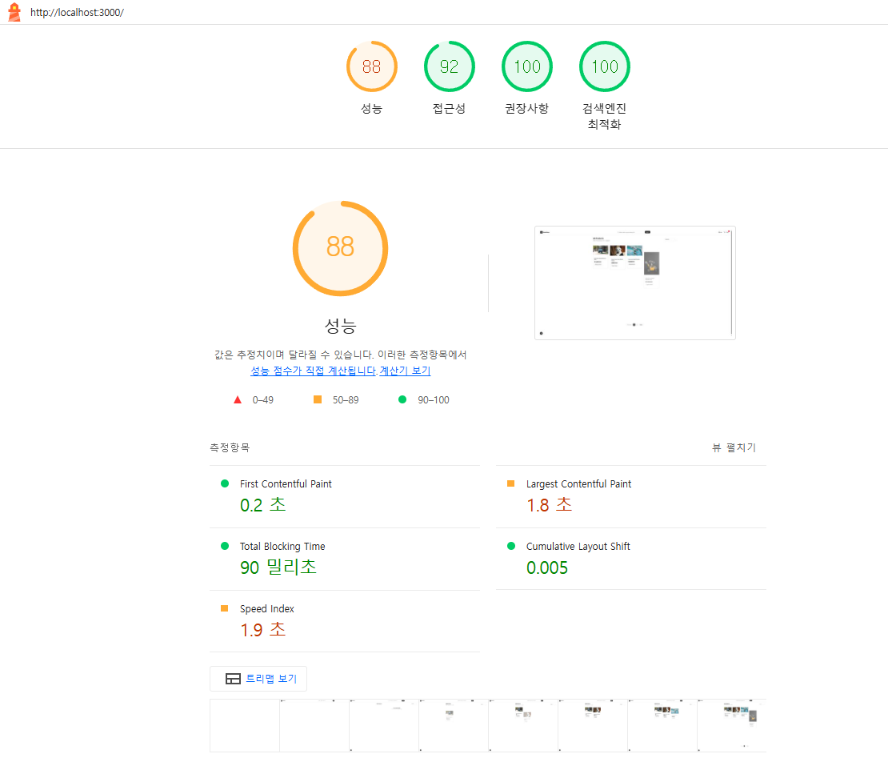
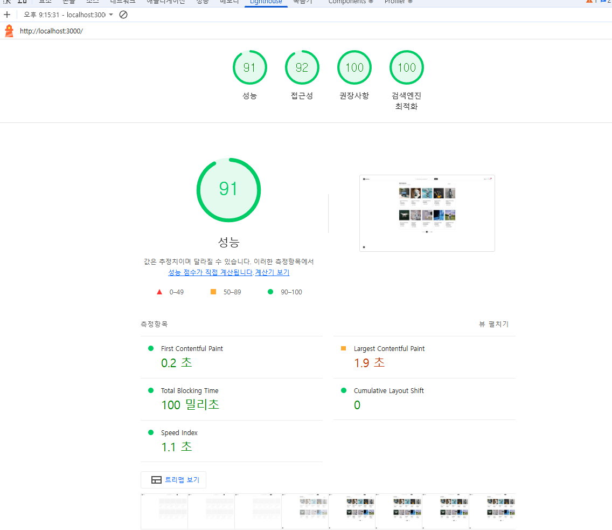

# 프로젝트 주요 기술 및 전략

## 1. 인터랙션 애니메이션 효과 (마이크로 인터랙션)

- **적용 위치:**
  - `OrderCompleteModal` (Lottie 애니메이션 + framer-motion)
  - `CartItem`, `ProductGallery` 등 (framer-motion)
- **사용 기술:** Lottie 애니메이션, framer-motion
- **내용:** 체크 아이콘과 버튼 등장 애니메이션 구현
- **효과:** 주문 완료 시 시각적 피드백 제공 → 사용자가 행동 완료를 명확히 인지
- **UX 개선:** 앱과의 상호작용 경험을 풍부하게 하여 전반적인 UX 향상

---

## 2. 스켈레톤 로더

- **컴포넌트:** `ProductDetailSkeleton`, `ProductGridSkeleton`, `CartSkeleton`
- **내용:** 초기 로딩 시 실제 데이터 대신 레이아웃 기반 자리 표시자 표시
- **효과:**
  - 로딩 상태 명확히 인지 가능
  - 체감 로딩 시간 단축
- **적용 화면:** 상품 상세 페이지, 상품 목록 페이지, 장바구니

---

## 3. LCP / CLS 개선

- **적용 방법:**

  - 스켈레톤 로더 적용 → 실제 콘텐츠 렌더 전 자리 확보로 LCP 지연 최소화
  - framer-motion 초기 opacity, y-offset, scale 값 지정 → 요소 등장 시 레이아웃 이동 방지로 CLS 최소화
  - Next.js Image 컴포넌트 사용 + aspect-square / width·height 명시 → 이미지 로드 시 레이아웃 안정성 확보
  - 카드 및 그리드 레이아웃에 고정 크기 지정 → 렌더 시 CLS 발생 최소화

  
  

---

## 4. 캐싱 전략

- **기술:** React Query (`QueryClientProvider`, `useProducts`, `useCart`)
- **데이터 캐시:**
  - 상품 목록 조회: `queryKey = ["products", "list", params]`
  - 상품 상세 조회: `queryKey = ["products", "detail", targetId]`
  - 장바구니: `queryKey = ["cart"]`
- **무효화 기준:**
  - 장바구니 변경 시 → 장바구니 쿼리 무효화
  - 재고 변경 시 → 상품 목록 쿼리 무효화
- **React Query 옵션:** `staleTime: 30초`, `retry: 1회` → 네트워크 요청 최적화

---

## 5. 다국어 전략 (i18n)

- **적용 위치:** `Header`, `ProductList`, `CartPage`, `OrderCompleteModal`
- **기술:** `useTranslation()` 훅, `en.json` / `ko.json`
- **구조:**
  - `TranslationProvider`를 최상위 레이아웃(`layout.tsx`)에 적용 → 전체 컴포넌트에서 번역 가능
  - 언어별 JSON 파일(`en.json`, `ko.json`) 사용
- **언어 상태 관리:**
  - `useLangStore`에서 `lang` 값(`ko` / `en`) 관리
  - 사용자가 선택한 언어에 따라 번역 텍스트를 실시간 반영
- **번역 키 관리 규칙:**
  - 단순 키(flat 구조, dot notation 없음) 사용
  - 모든 번역 키는 컴포넌트명 또는 페이지명 기준으로 네이밍 일관성 유지
  - 새로운 페이지/컴포넌트 추가 시 JSON에 키 추가 후 `useTranslation()`으로 사용

---

## 6. 반응형 및 모바일 대응

- **기술:** TailwindCSS 반응형 유틸리티 (`sm:`, `lg:` 등)
- **내용:** 모바일/데스크톱 환경에 맞춰 UI 유연하게 변화
- **예시:** `Header` 컴포넌트 → 모바일 시 검색창, 버튼, 장바구니를 단독 줄 혹은 한 줄 배치
- **효과:** 유지보수 용이, 모바일 퍼스트 설계 지원

---

## 7. 세션 및 API 통신 관리

- **기술:** `axiosSession` 인터셉터
- **내용:**
  - 모든 API 요청에 `x-session-id` 헤더 자동 추가 → 익명 사용자도 장바구니 사용 가능
  - POST, PATCH 등 GET이 아닌 요청 시 `Content-Type: application/json` 자동 설정
- **적용 API:** 상품, 장바구니, 주문 등 전반적인 백엔드 통신
